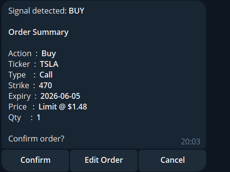
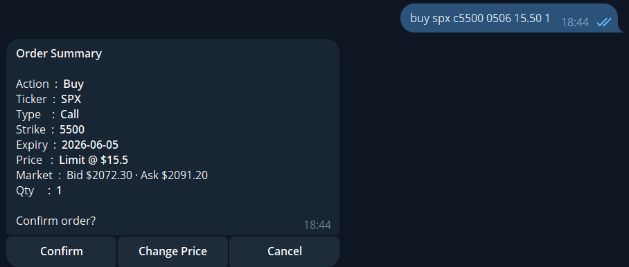
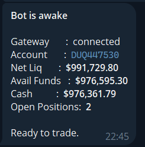
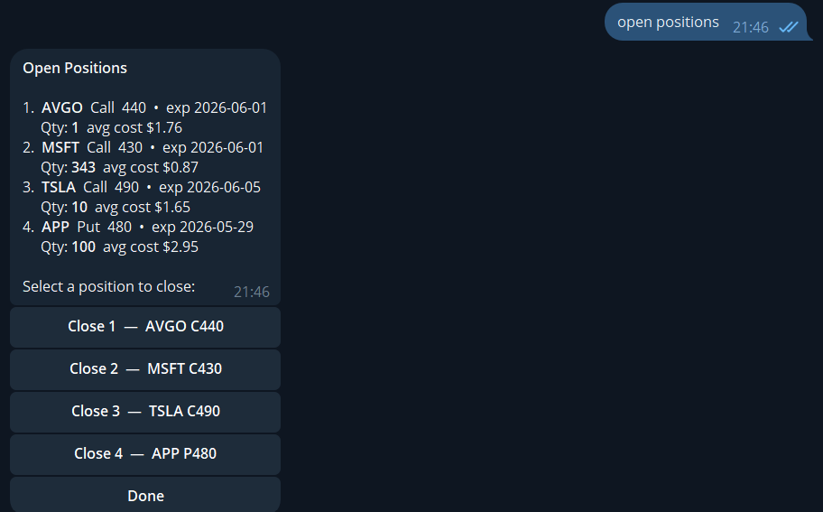

# Telegram → IBKR Signal Trade Copier

> **Copies trade signals from a Telegram channel straight into Interactive Brokers as live options orders.**

A trade-copier bot that bridges a **Telegram signal channel** and an **Interactive Brokers** account. It listens to a channel in real time, reads each posted signal — including **screenshots, via OCR** — and turns it into a ready-to-confirm options order on IBKR. Beyond the automated signal flow, it doubles as a full manual trading terminal in Telegram: place orders by text, preview live bid/ask/last before confirming, and manage open positions and working orders — all from chat.

**Highlights**

- 📡 **Live signal listening** — watches a Telegram channel and reacts to every new signal instantly.
- 🖼️ **OCR signal parsing** — extracts ticker, strike, expiry, side, and price from signal *images* (Google Vision, Tesseract fallback).
- ⚡ **One-tap copy to broker** — a parsed signal becomes a confirmable IBKR order in two taps.
- 💹 **Live market data** — bid/ask/last shown at confirmation so you never trade blind.
- 🧾 **Full order management** — buy/sell, limit/market, position closing, and pending-order cancel/modify.
- 🔐 **Secure web login** — switch paper/live and enter broker credentials via a one-time private web form (never through Telegram).
- ♻️ **Self-healing deployment** — a watchdog auto-restarts the broker gateway within seconds of any crash.

---

## Screenshots

**Signal auto-detected from the channel → ready-to-confirm order**
A signal posted to the Telegram channel is OCR-parsed and turned into a filled order in two taps.



**Live market data at confirmation**
Live bid/ask is pulled from IBKR and shown before you confirm — you never trade blind.



**Live IBKR account connection**
The bot connects to IB Gateway and reports real account status on demand.



**Position management from chat**
List open option positions and close any of them (full, partial, or by percentage).



---

## Table of Contents

1. [Screenshots](#screenshots)
2. [Features](#features)
3. [Architecture](#architecture)
4. [Requirements](#requirements)
5. [Configuration (`.env`)](#configuration-env)
6. [Setup](#setup)
7. [Bot Command Reference](#bot-command-reference)
8. [Order Format](#order-format)
9. [Signal Listener (Telethon)](#signal-listener-telethon)
10. [OCR Pipeline](#ocr-pipeline)
11. [Web-Based Login](#web-based-login)
12. [Market Data Behaviour](#market-data-behaviour)
13. [Deployment & Auto-Recovery](#deployment--auto-recovery)
14. [IBKR Gotchas Worth Knowing](#ibkr-gotchas-worth-knowing)
15. [Project Structure](#project-structure)

---

## Features

- **Place options orders from Telegram** — buy/sell, calls/puts, market or limit.
- **One-line orders:** `buy spy c609 0605 mkt 2`.
- **Step-by-step guided flow:** just type `buy` or `sell` and answer each prompt.
- **Live market data at confirmation** — bid / ask / last shown before you confirm.
- **Open positions** — list and close (partial `5 mkt`, full `all`, or percentage `50%`).
- **Pending orders** — list, cancel, or modify the limit price (cancel + replace).
- **Signal listener** — watches a Telegram channel, OCRs signal images, and produces a confirmable order automatically.
- **Web-based login** — switch between paper/live and enter IBKR credentials through a one-time private web form (credentials never travel through Telegram).
- **Authorized-user gating** — only whitelisted Telegram user IDs can use the bot.
- **Automatic gateway recovery** — a watchdog restarts IB Gateway within seconds of any crash.

---

## Architecture

```
Telegram  ──►  python-telegram-bot (PTB)  ──►  handlers  ──►  ibkr/client.py  ──►  IB Gateway
                       ▲                                              (ib_insync, thread-isolated)
                       │
Signal channel  ──►  Telethon listener (daemon thread)  ──►  OCR  ──►  parsed order  ──►  PTB
```

- **PTB** runs the main event loop and all command/conversation handlers.
- **ib_insync** talks to IB Gateway. Every IBKR call runs in its own short-lived thread with its own event loop, so blocking IBKR calls never stall PTB.
- **Telethon** runs in a **separate daemon thread** with an isolated event loop. Work that touches PTB (sending messages, reading `user_data`) is marshalled back onto the PTB loop with `run_coroutine_threadsafe`.

> **Python event-loop note:** `bot.py` must call `asyncio.set_event_loop(asyncio.new_event_loop())` as its *first* statements, before any import — `eventkit` (an `ib_insync` dependency) calls `get_event_loop()` at import time and newer Python versions no longer auto-create one.

---

## Requirements

- **Python 3.11+**
- **IB Gateway** (paper or live), reachable on a local socket port
- A **Telegram bot token** from [@BotFather](https://t.me/BotFather)
- **Telegram API credentials** (`api_id` / `api_hash`) from [my.telegram.org](https://my.telegram.org) — only needed for the signal listener
- **Tesseract OCR** installed locally *(fallback OCR)* — optional if you use Google Vision
- A **Google Cloud Vision API key** *(preferred OCR)* — optional

Install Python dependencies:

```bash
pip install -r requirements.txt
```

`requirements.txt`:
```
python-telegram-bot==21.11.1
python-dotenv==1.0.1
ib_insync==0.9.86
telethon==1.43.2
```

---

## Configuration (`.env`)

Copy `.env.example` to `.env` and fill in your own values. **Never commit `.env`.**

| Variable | Required | Description |
|---|---|---|
| `TELEGRAM_BOT_TOKEN` | yes | Bot token from BotFather |
| `AUTHORIZED_USER_IDS` | yes | Comma-separated Telegram user IDs allowed to use the bot |
| `IBKR_HOST` | yes | Usually `127.0.0.1` |
| `IBKR_PORT` | yes | `4002` = Gateway paper, `4001` = Gateway live (`7497`/`7496` for TWS) |
| `IBKR_CLIENT_ID` | yes | Base client ID (the bot derives others from it) |
| `TELEGRAM_API_ID` | listener only | Telegram `api_id` from my.telegram.org |
| `API_HASH` | listener only | Telegram `api_hash` |
| `SIGNAL_CHANNEL` | listener only | Numeric ID of the channel to watch (e.g. `-100…`) |
| `GOOGLE_VISION_API_KEY` | optional | Enables Google Vision OCR; falls back to Tesseract if unset |
| `LOGIN_PORT` | optional | Port for the web login form (default `7823`) |

> All IBKR connection vars are read **at call time**, not at import — so the web-login flow can switch paper↔live (port `4002`↔`4001`) without restarting the bot.

---

## Setup

1. **Install dependencies** — `pip install -r requirements.txt`.

2. **Create `.env`** — copy `.env.example` and fill in your values.

3. **Configure IB Gateway:**
   - Configure → Settings → API → Settings
   - Enable *ActiveX and Socket Clients*
   - **Uncheck Read-Only API**
   - Set the socket port to match `IBKR_PORT`

4. **First-run authentication for the signal listener** (one time):
   The first time Telethon connects it will prompt for your phone number and a login code. After that, the session is stored in `listener.session` and no re-login is needed. **Do not delete `listener.session`** or you'll have to re-authenticate.

5. **Run the bot:**
   ```bash
   python bot.py
   ```

---

## Bot Command Reference

### Orders
| Command | Description |
|---|---|
| `buy` / `sell` | Start the step-by-step order flow |
| `buy tsla c500 0106 1.8 2` | One-liner: buy 2× TSLA 500 Call exp Jun 1 at $1.80 limit |
| `buy tsla c500 0106 mkt 2` | One-liner: market order (buy fills at bid, sell at mid) |

### Account
| Command | Description |
|---|---|
| `details` | Account summary — net liq, available funds, cash, open-position count |
| `open positions` | List option positions; tap one to close (partial / full / %) |
| `pending orders` | List working orders; tap one to cancel or change price |

### Session
| Command | Description |
|---|---|
| `login` | Choose paper/live and open a one-time web form to enter credentials |
| `wake up` | Start the gateway (if down) and show the account summary |
| `sleep` | Fast-kill the gateway + watchdog (leaves IBKR session to drop) |
| `logout` | **Graceful** IBKR logout (SIGTERM, clean session close) then stop |
| `/cancel` | Abort the current flow |
| `/help` | Show help |

### Inside flows
| Input | Where | Meaning |
|---|---|---|
| `0` | Close-position prompt | Go back to the positions list |
| `mkt` | Any price prompt | Market order (bid for buys, mid for sells) |
| `all` / `50%` | Sell quantity | Close full / partial position |

> The gateway **auto-wakes** when you start an order or account command — there's no need to wake it manually first.

---

## Order Format

```
buy  spy  c609 0605 mkt   2      buy 2 SPY 609 Call exp Jun 5, market
sell tsla p200 1512 3.50  1      sell 1 TSLA 200 Put exp Dec 15, limit $3.50
sell spy  c609 0605 mkt   50%    sell 50% of current position, market
sell spy  c609 0605 mkt   all    close full position, market
```

Pattern: `action ticker c/p+strike DDMM price qty`

- **Date is `DDMM`** — `0506` = May 6. A date earlier than today rolls to next year.
- **Price** — a number for a limit, or `mkt` for market.
- **Quantity** — a positive integer; sells additionally accept `all` or `N%`.

---

## Signal Listener (Telethon)

The listener watches a Telegram **signal channel** and turns posted signals into confirmable orders. It is the most subtle part of the system, so it has its own design notes.

### What it does

1. Subscribes to `SIGNAL_CHANNEL` using a **Telethon user session** (your own Telegram account, authenticated via `TELEGRAM_API_ID` / `API_HASH`).
2. On each new message it:
   - **Classifies direction** from Arabic keywords in the *text* (buy vs sell keywords → `BUY` / `SELL`; anything else is ignored).
   - **Requires an attached image** — text-only messages are skipped.
   - **OCRs the image** to extract ticker / type / strike / expiry / entry price (see [OCR Pipeline](#ocr-pipeline)).
   - **Builds a pending order** and DMs each authorized user an order summary with **Confirm / Cancel**.
3. **Confirm** → the bot asks for `price quantity` (e.g. `3.50 10` or `mkt 5`), then places the order immediately.
4. **Missing OCR fields** → the bot asks the user to supply each missing field (ticker, type, strike, expiry) one at a time, then proceeds to price + quantity.

### Why it runs in a daemon thread

Telethon was originally launched as an `asyncio` task on PTB's event loop. On bot restart/cleanup, PTB cancels its tasks — and **`asyncio.CancelledError` is a `BaseException`, not an `Exception`**, so a `try/except Exception` reconnect loop never caught it. The task died silently and signals were missed.

The fix: `start_signal_listener()` spins up a **daemon thread** with its own event loop and runs the Telethon reconnect loop there. PTB's loop cannot cancel it. Cross-thread work (sending Telegram messages, touching `user_data`) is scheduled back onto PTB's loop with:

```python
asyncio.run_coroutine_threadsafe(coro, ptb_loop)
```

The thread is `daemon=True`, so it exits cleanly when the bot process stops — no zombies.

### Session file

- Telethon stores its login in `listener.session` (a SQLite file).
- It survives restarts; deleting it forces a fresh phone-number + code login.
- It is **git-ignored** (it contains an active session — treat it like a credential).

### Getting the channel ID

Private channel IDs are the numeric `-100…` form. You can obtain one from a bot like `@userinfobot`, or from the channel's invite link. Put it in `SIGNAL_CHANNEL`.

---

## OCR Pipeline

Signal images are broker position-card screenshots. Two OCR backends are supported:

| Backend | When used | Notes |
|---|---|---|
| **Google Cloud Vision** | when `GOOGLE_VISION_API_KEY` is set | More accurate on coloured/stylised fonts; called via REST (`urllib`, no extra deps) |
| **Tesseract (pytesseract)** | fallback when no key | Local, free; weaker on coloured text |

The parser (`signal_parser.py`) handles **both text layouts** — Vision tends to emit the price on the *last* line while Tesseract puts it on the *first* — so `parse_order()` checks both and ignores a value equal to the strike.

Extracted fields: `ticker`, `option_type` (C/P), `strike`, `expiry` (`YYYY-MM-DD`), `entry_price`.

Test the OCR against the sample images:

```bash
python test_gvision.py --key YOUR_VISION_API_KEY
```

---

## Web-Based Login

Rather than typing IBKR credentials into Telegram (where they'd transit Telegram's servers), the `login` command:

1. Asks you to pick **Live** or **Paper**.
2. Spins up a **temporary local HTTP server** (default port `LOGIN_PORT=7823`) protected by a random one-time token, and DMs you a link.
3. You open the link in a browser and submit username + password **directly to the server**.
4. The server (used once, then shut down — also auto-expires after ~2 minutes) updates the gateway config, switches the port (paper `4002` ↔ live `4001`), restarts the gateway, and replies with the account summary to confirm the login succeeded.

Credentials therefore never pass through Telegram. The login web port must be reachable from your browser (open it in the host firewall).

> **Note:** IB Gateway / IBC store the password in plain text in their own config regardless of how it's entered — so securing host access (SSH keys, no password auth) matters more than the input channel.

---

## Market Data Behaviour

`get_market_data()` resolves a price for the confirmation screen in this order:

1. **Portfolio price** — instant, no subscription, for contracts you already hold (gives `last`).
2. **Live snapshot** — `reqMarketDataType(1)` + `reqMktData(snapshot=True)`.
3. **Delayed snapshot** — `reqMarketDataType(3)` (free, 15–20 min delayed).
4. Falls back to the portfolio `last` if nothing else is available.

Key rules baked in:

- **Always `snapshot=True`.** Streaming (`snapshot=False`) creates persistent server-side market-data auth locks that cause *"competing live session"* errors to accumulate.
- **Index options (SPX/NDX) request data over the `CBOE` exchange.** Routing them through `SMART` triggers a competing-session error even when nothing else is connected. Qualification can still go through `SMART`; only the data request needs `CBOE`.
- **Only one live market-data session per account.** If the same IBKR account is logged in elsewhere (mobile/desktop), the API gets no data until that other session is closed.

---

## Deployment & Auto-Recovery

The bot is designed to run unattended on a Linux VPS alongside IB Gateway (driven headlessly by **IBC**).

**Watchdog:** a small shell loop (run under `tmux`) checks the gateway port every ~15 seconds. If the port is down it kills any stale gateway process and relaunches via IBC, then polls until the port is back. Worst-case downtime is roughly *detection (15s) + login (~60–90s)*.

**IBC config essentials:**
- `AcceptNonBrokerageAccountWarning=yes` — auto-accepts the paper-trading disclaimer.
- `OverrideReadOnlyApi=yes` — auto-clears the Read-Only API dialog so the API is writable.
- Credentials + `TradingMode` are rewritten by the `login` flow when you switch accounts/modes.

**clientId allocation** (derived from `IBKR_CLIENT_ID`, here shown for base `1`):

| clientId | Purpose |
|---|---|
| 1 | Place / cancel / modify orders (must own the orders it touches) |
| 2 | Account summary |
| 3 | Open positions |
| 4 | Pending-orders fetch |
| +5 | Market-data requests |

---

## IBKR Gotchas Worth Knowing

These were learned the hard way; they're worth keeping in mind when extending the bot:

- **Never call `reqAllOpenOrders()` on a short-lived connection.** It *rebinds* all open orders to that connection; when the connection drops, IBKR cancels every rebound order. Cancel/modify use direct `ib.client.cancelOrder(...)` + cancel-and-replace instead.
- **Cancel/modify must use the same clientId that placed the order** — cross-clientId order operations are silently ignored.
- **Order rejection reasons (e.g. Error 202) arrive via `ib.errorEvent`, not the trade log.** The placer subscribes to `errorEvent`, waits a few seconds for async errors, then unsubscribes. Market-data-farm notices (2104, 2119, 2158, …) and the TIF=DAY notice (10349) are filtered out as noise.
- **A `DDMM` date that isn't a valid trading day** (e.g. a weekend) yields no contract — that's expected, not a bug.
- **Today's date is kept, not rolled forward** — the date parser bumps to next year only for dates strictly *before* today.

---

## Project Structure

```
bot.py                 entry point — wires handlers, conversations, starts the listener
tg/
  handlers.py          conversation states, order parsing, command handlers, login flow
  messages.py          all message strings + formatters
  keyboards.py         inline keyboard builders
  callbacks.py         callback_data constants
  signal_listener.py   Telethon daemon-thread listener
ibkr/
  client.py            ib_insync integration (orders, positions, market data, account)
signal_parser.py       BUY/SELL classification + OCR (Vision/Tesseract) + field parsing
signal_examples/       sample signal images + JSON for OCR testing
test_connection.py     standalone: connect + qualify a contract
test_orders.py         standalone: list open orders
test_listener.py       standalone: channel listener that archives messages/images
test_gvision.py        standalone: compare Google Vision vs Tesseract on samples
requirements.txt
.env.example           template — copy to .env and fill in
```

---

## License

Private project. Not for redistribution.
